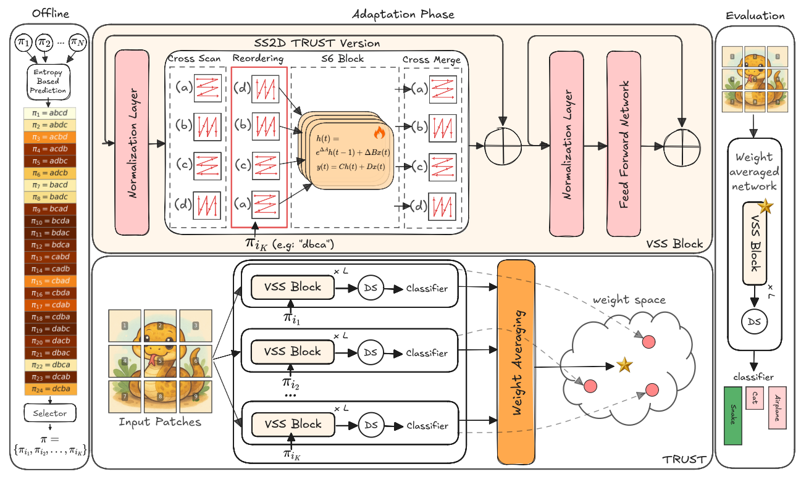

# TRUST: Test-Time Refinement using Uncertainty-Guided SSM Traverses

This repository is the official implementation of TRUST. 

## Abstract
State Space Models (SSMs) have emerged as efficient alternatives to Vision Transformers (ViTs), with VMamba standing out as a pioneering architecture designed for vision tasks. However, their generalization performance degrades significantly under distribution shifts. To address this limitation, we propose TRUST (Test-Time Refinement using Uncertainty-Guided SSM Traverses), a novel test-time adaptation (TTA) method that leverages diverse traversal permutations to generate multiple causal perspectives of the input image. Model predictions serve as pseudo-labels to guide updates of the Mamba-specific parameters, and the adapted weights are averaged to integrate the learned information across traversal scans. Altogether, TRUST is the first approach that explicitly leverages the unique architectural properties of SSMs for adaptation. Experiments on seven benchmarks show that TRUST consistently improves robustness and outperforms existing TTA methods.

## Overview
<p align="center">
  
</p>

## Requirements

## Requirements 
- [Python 3.8](https://www.python.org/)
- [CUDA 12.1](https://developer.nvidia.com/cuda-zone)
- [PyTorch 2.1.0](https://pytorch.org/)


## Usage
### Step 1: Clone the repository

```bash
git clone repository
```

### Step 2: Setup the Environment

To install requirements:

```
conda create -n trust
conda activate trust

pip install -r requirements.txt
cd backbones/VMamba/kernels/selective_scan && pip install .
```

### Step 3: Prepare Datasets

Supported datasets:

- [CIFAR10-C](https://zenodo.org/records/2535967#.YzHFMXbMJPY)
- [CIFAR100-C](https://zenodo.org/records/2535967#.YzHFMXbMJPY)
- [ImagNet-C](https://zenodo.org/records/2235448)
- [ImagNet-S](https://drive.usercontent.google.com/download?id=1Mj0i5HBthqH1p_yeXzsg22gZduvgoNeA&export=download&authuser=0)
- [ImagNet-V2](https://huggingface.co/datasets/vaishaal/ImageNetV2/tree/main)
- [ImagNet-R](https://people.eecs.berkeley.edu/~hendrycks/imagenet-r.tar)
- [PACS](http://www.eecs.qmul.ac.uk/~dl307/project_iccv2017)

### Step 4: Build Directories

To set up the dataset, download them and modify their paths in [preliminaries](preliminaries.sh), then run the script:

```
bash preliminaries.sh
```

## Adaptation

There are different bash files in [bash](utils/bash) directory which are prepared to reproduce the results of the paper for different datasets and domains. As an example, here is how to run TRUST method for different datasets:

```eval
bash utils/bash/trust.sh
```

## Results

Here are the results of our prposed `TRUST` method on different datasets:
### [Image Classification]()

| **Method**       | **CIFAR10-C** | **CIFAR100-C** | **ImageNet-C** | **ImageNet-S** | **ImageNet-V2** | **ImageNet-R** | **PACS** |
|------------------|---------------|----------------|----------------|----------------|------------------|----------------|----------|
| Source only      | 65.9          | 41.2           | 38.7           | 31.4           | 62.2             | 31.3           | 66.7     |
| ETA              | 65.8          | 41.4           | 40.8           | 31.4           | 62.2             | 31.3           | 66.7     |
| LAME             | 65.9          | 41.2           | 38.8           | 31.4           | 62.2             | 31.3           | 66.7     |
| SAR              | 66.8          | 41.9           | 41.5           | 32.6           | 62.4             | 32.0           | 67.3     |
| SHOT             | 66.8          | 42.0           | 41.7           | 32.6           | 62.4             | 31.9           | 67.4     |
| TENT             | 66.5          | 41.8           | 41.6           | 32.5           | 62.3             | 31.9           | 67.4     |
| TRUST naive      | 74.2          | 49.8           | 53.4           | 41.1           | 63.4             | 39.7           | 67.1     |
| **TRUST**        | **77.5**      | **54.3**       | **56.1**       | **41.5**       | **64.0**         | **44.3**       | **69.9** |


## Acknowledgment

This project is based on VMamba ([paper](https://arxiv.org/abs/2401.10166), [code](https://github.com/MzeroMiko/VMamba/tree/main)), thanks for their excellent works.
